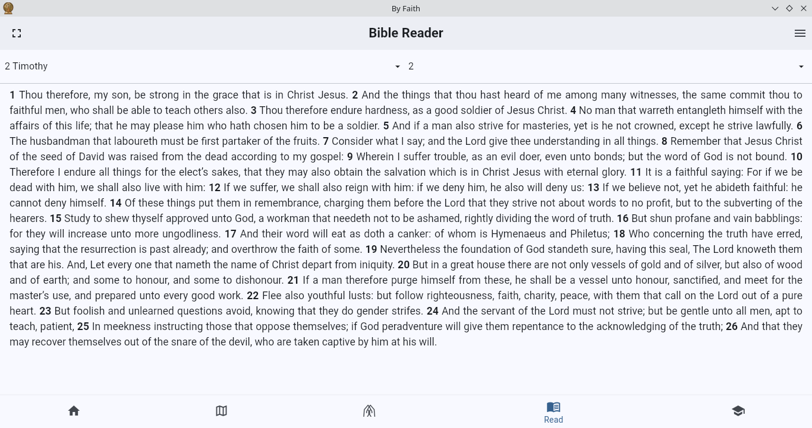
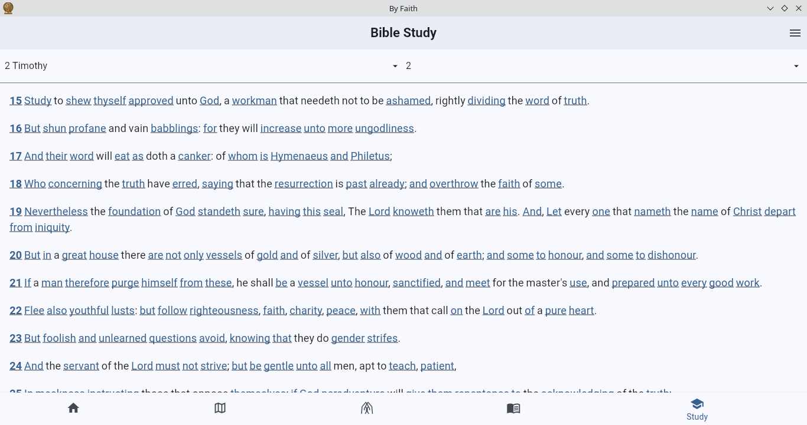
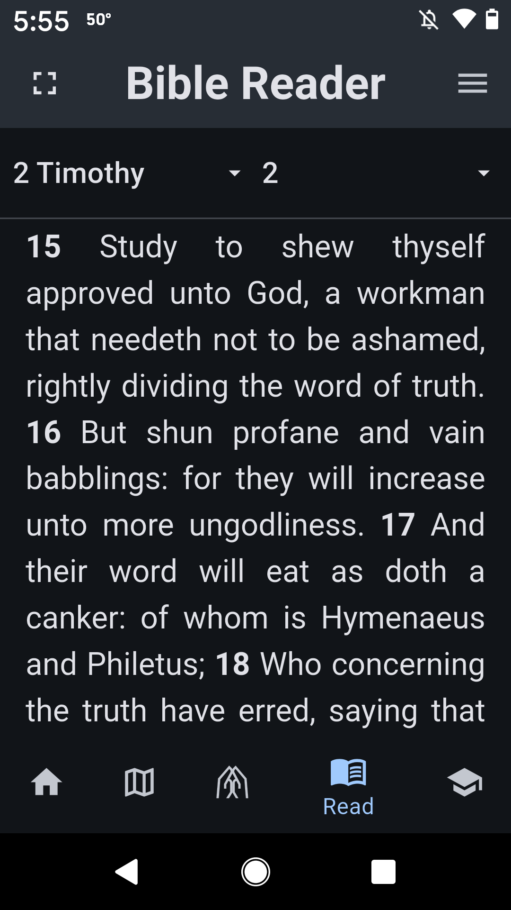

# By Faith App

A cross platform application built with Flutter, designed to provide resources for reading, studying, praying, evangelism and missions.

## Features

- **Home:** Features a dashboard.
- **Gospel:** Content related to the Gospel, and integration of osm map data, for         geographical context related to soul winning or missions. Also Offline support with Map Markers to Contact Management.
- **Pray:** Features to support a prayer life, create and share your prayers.
- **Read:** Read the KJV Bible, auto scrolling and save your bookmarks or favorite versus.
- **Study:** Tools and resources for in-depth study of the scriptures using Strong's Greek and Hebrew Numbers, KJV definitions, Websters 1828 dictionary. Every scripture verse can be notated with Notes Manager.

## Getting Started

This project is a Flutter application. To get started:

1. Ensure you have Flutter installed. Follow the official guide: [Install Flutter](https://docs.flutter.dev/get-started/install)
2. Clone the repository:
   ```bash
   git clone <repository_url>
   ```
3. Navigate to the project directory:
   ```bash
   cd by_faith_app
   ```
4. Get the project dependencies:
   ```bash
   flutter pub get
   ```
5. Run the app on a connected device or emulator:
   ```bash
   flutter run
   ```

## Screens

#Linux





#Android





## Contributing

Contributions are welcome! Please see the CONTRIBUTING.md (if it exists) for details.

## License

This project is licensed under the MIT License - see the [LICENSE](LICENSE) file for details.
